# 🍔 Zomato UI Clone - Android App

<div align="center">
  
  
  <h3>A feature-rich food delivery application built with Jetpack Compose</h3>
  
  [](https://developer.android.com/)
  [](https://kotlinlang.org/)
  [](https://developer.android.com/jetpack/compose)
  [](https://m3.material.io/)
  [](https://developer.android.com/about/versions/nougat)
  [](https://developer.android.com/)
</div>

---

## 📱 App Screenshots

<div align="center">

### 🔐 Authentication Flow
<table>
  <tr>
    <td>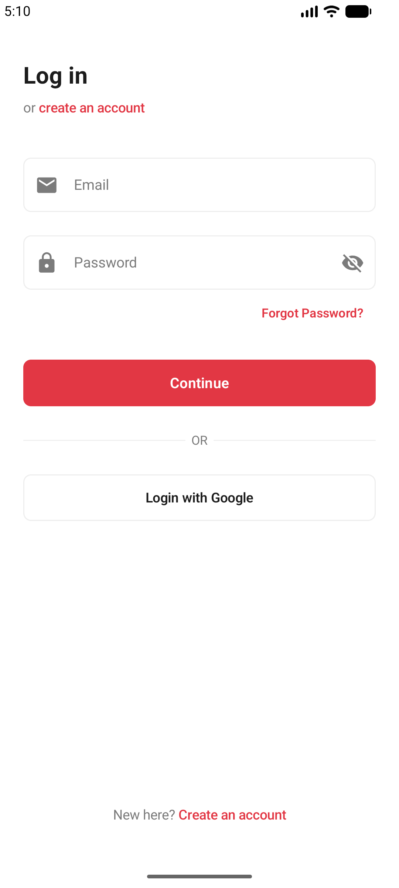</td>
    <td>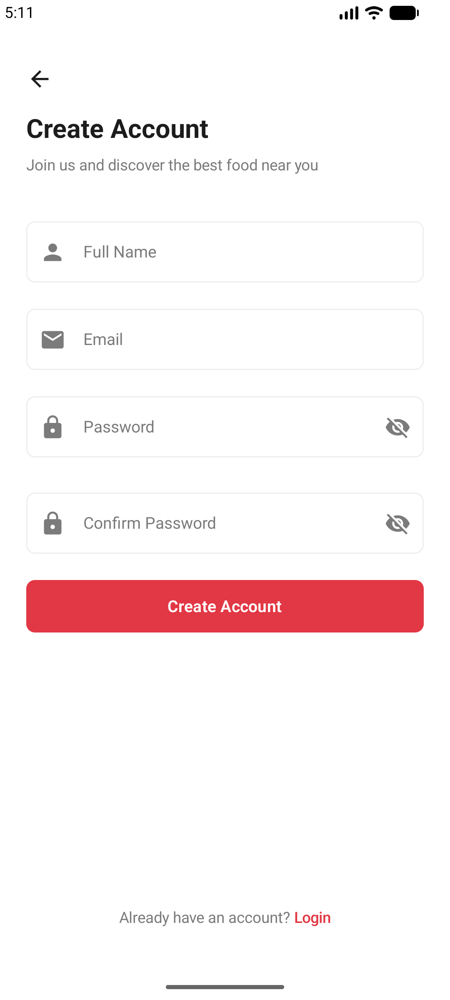</td>
  </tr>
  <tr>
    <td align="center"><b>Login Screen</b></td>
    <td align="center"><b>Sign Up Screen</b></td>
  </tr>
</table>

### 🏠 Main App Experience
<table>
  <tr>
    <td>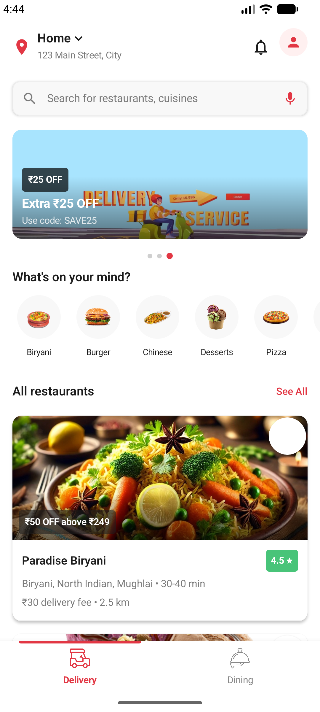</td>
    <td>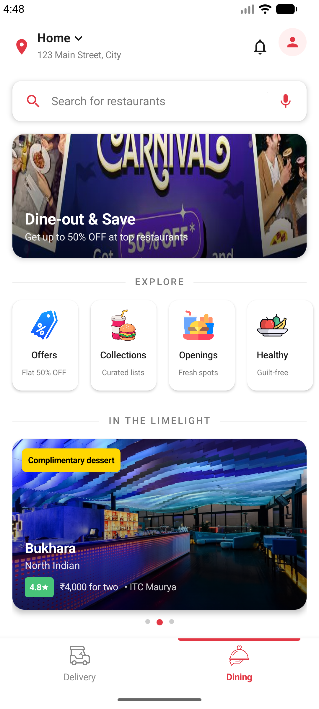</td>
    <td>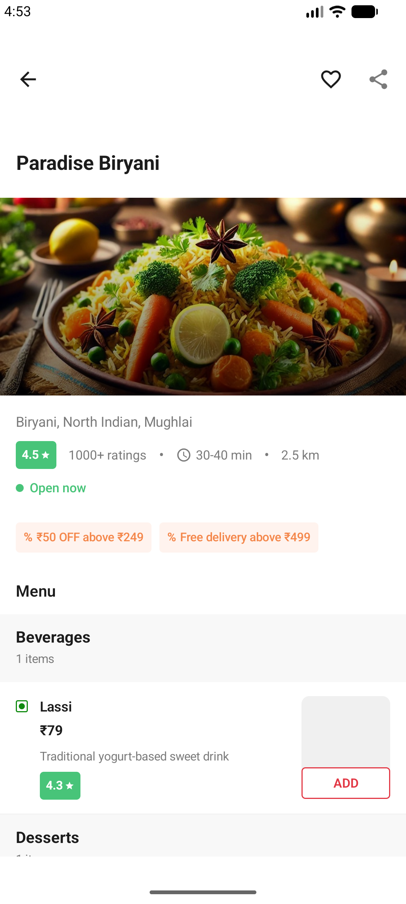</td>
  </tr>
  <tr>
    <td align="center"><b>Delivery Home</b></td>
    <td align="center"><b>Dining Screen</b></td>
    <td align="center"><b>Restaurant Details</b></td>
  </tr>
</table>

### 🛒 Shopping & Orders
<table>
  <tr>
    <td>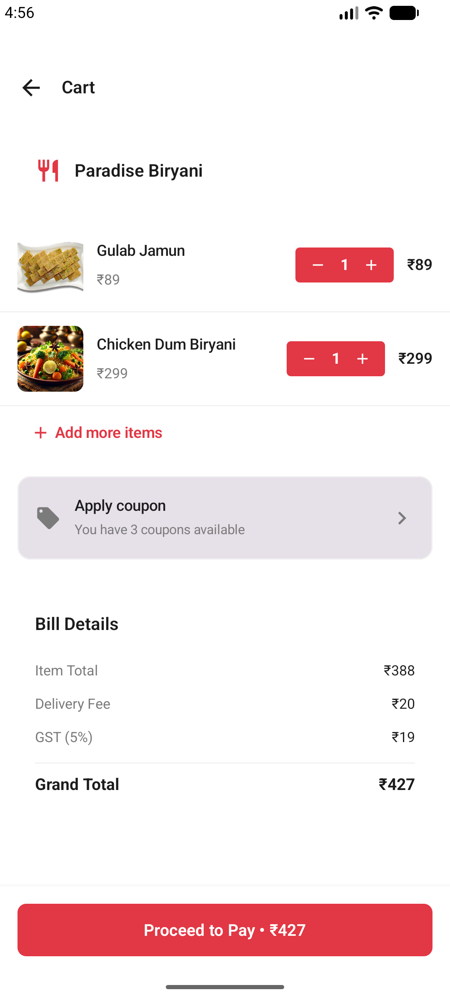</td>
    <td>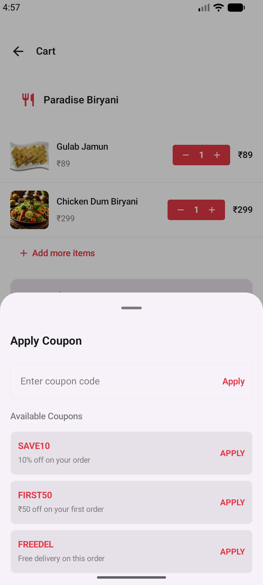</td>
    <td>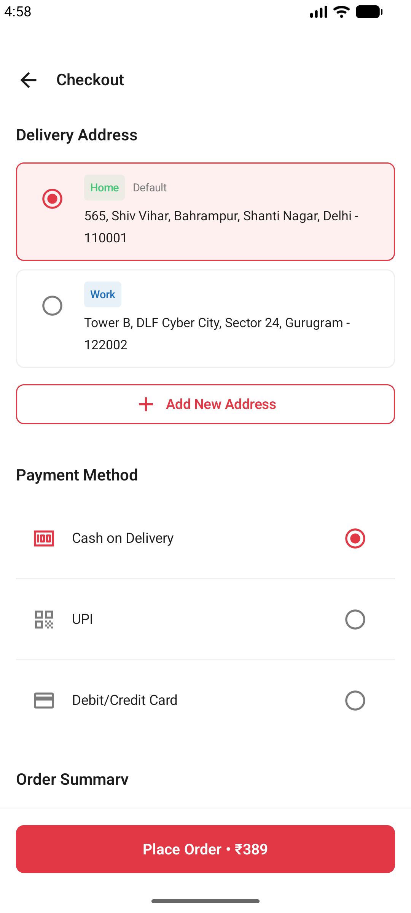</td>
  </tr>
  <tr>
    <td align="center"><b>Cart</b></td>
    <td align="center"><b>Apply Coupons</b></td>
    <td align="center"><b>Checkout</b></td>
  </tr>
</table>

### 🎉 User Features
<table>
  <tr>
    <td>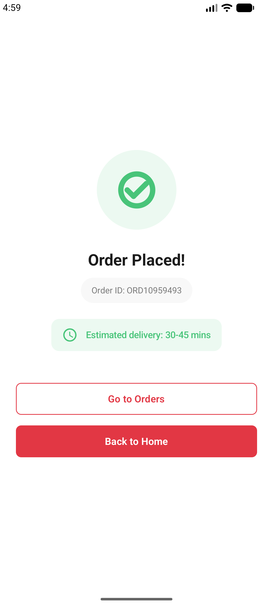</td>
    <td>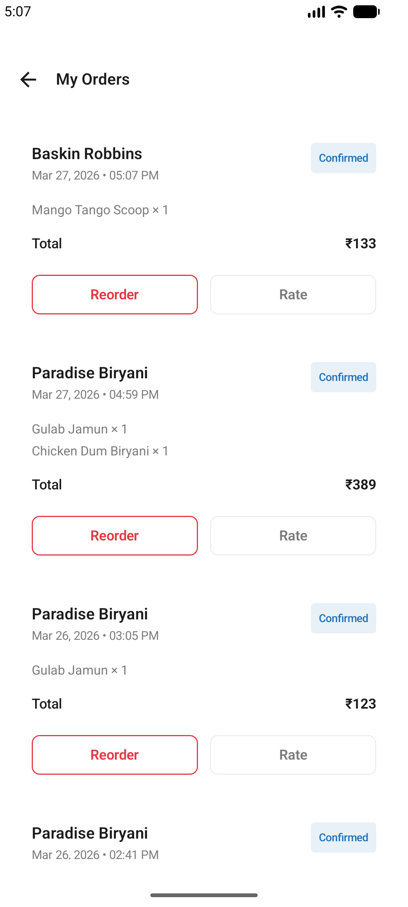</td>
    <td>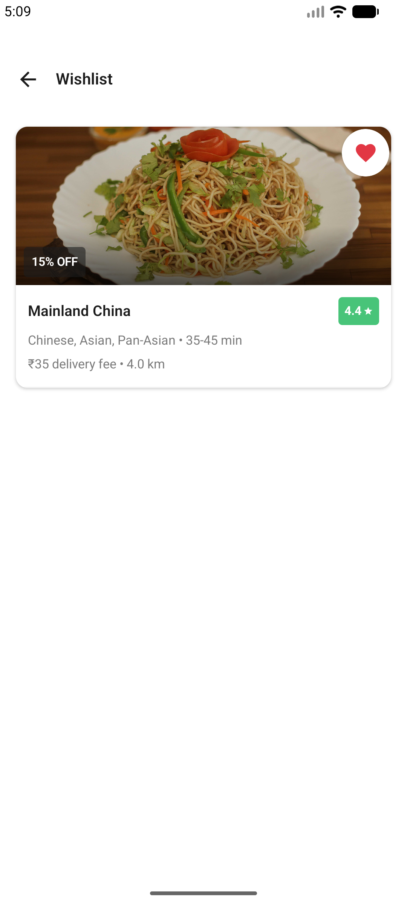</td>
  </tr>
  <tr>
    <td align="center"><b>Order Placed</b></td>
    <td align="center"><b>Order History</b></td>
    <td align="center"><b>Wishlist</b></td>
  </tr>
</table>

<table>
  <tr>
    <td>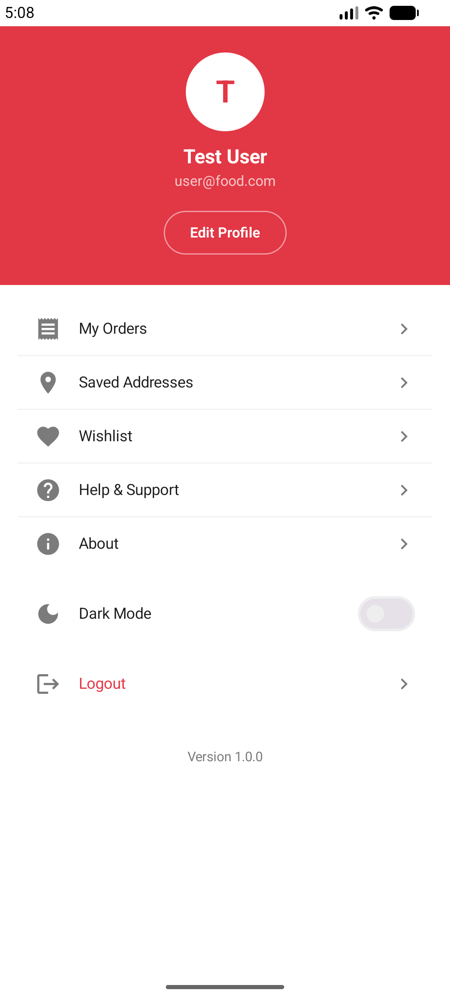</td>
  </tr>
  <tr>
    <td align="center"><b>User Profile</b></td>
  </tr>
</table>

</div>

---

## ✨ Features

### 🎯 Core Features
- ✅ **Dual Mode Navigation** - Delivery & Dining modes with seamless bottom navigation
- ✅ **Smart Search** - Real-time search with 300ms debounce and recent searches
- ✅ **Category Filtering** - Browse restaurants by food categories (Biryani, Pizza, Chinese, etc.)
- ✅ **Restaurant Discovery** - Explore 20+ restaurants with ratings, delivery time & offers
- ✅ **Dynamic Menu** - Browse menu items with veg/non-veg filters and categories
- ✅ **Smart Cart System** - Single-restaurant cart with automatic conflict resolution
- ✅ **Coupon System** - Apply discount coupons (SAVE10, FIRST50, FREEDEL)
- ✅ **Order Management** - Complete order history with status tracking
- ✅ **Wishlist** - Save favorite restaurants for quick access
- ✅ **Multi-Address Management** - Add, edit, and set default delivery addresses
- ✅ **User Profiles** - Edit profile with name, phone, and settings

### 🔐 Authentication & Security
- ✅ **User Registration** - Secure account creation with validation
- ✅ **Login System** - Email/password authentication with session persistence
- ✅ **Role-Based Access** - Separate Admin and User roles
- ✅ **Password Hashing** - Secure password storage using MessageDigest
- ✅ **Session Management** - DataStore-based session persistence
- ✅ **Onboarding Flow** - First-time user introduction

### 💰 Smart Pricing System
- ✅ **Dynamic Delivery Fee** - ₹0 (≥₹499), ₹20 (₹299-₹499), ₹30 (<₹299)
- ✅ **GST Calculation** - Automatic 5% GST on all orders
- ✅ **Discount Coupons**:
  - `SAVE10` - 10% off on order total
  - `FIRST50` - Flat ₹50 off
  - `FREEDEL` - Free delivery
- ✅ **Real-time Total** - Grand total updates automatically with cart changes

### 🎨 UI/UX Excellence
- ✅ **Material 3 Design** - Modern, beautiful UI following Material Design 3
- ✅ **Dark Mode** - Full dark theme support with persistent preference
- ✅ **Shimmer Loading** - Skeleton screens while content loads
- ✅ **Smooth Animations** - Fade, slide, and scale animations throughout
- ✅ **Floating Cart Bar** - Persistent cart summary with slide-in animation
- ✅ **Bottom Navigation** - Animated bottom bar with indicator
- ✅ **Edge-to-Edge** - Immersive full-screen experience
- ✅ **Splash Screen** - Branded splash with scale animation

### 📊 Additional Features
- ✅ **Review System** - Restaurant ratings and customer reviews
- ✅ **Banner Carousel** - Promotional offers with auto-scroll
- ✅ **Veg-Only Filter** - Filter restaurants and menu items for vegetarians
- ✅ **Order Status Tracking** - Track orders from preparation to delivery
- ✅ **Admin Dashboard** - Admin panel for management (placeholder)

---

## 🏗️ Architecture & Tech Stack

### Architecture Pattern
```
┌─────────────────────────────────────┐
│      PRESENTATION LAYER             │
│  ┌──────────┐    ┌──────────┐      │
│  │ Screens  │◄──►│ViewModels│      │
│  │(Compose) │    │(StateFlow)│     │
│  └──────────┘    └────┬─────┘      │
└────────────────────────┼────────────┘
                         │
┌────────────────────────▼────────────┐
│         DATA LAYER                  │
│  ┌─────────────┐  ┌─────────────┐  │
│  │Repositories │◄►│Room + Store │  │
│  └─────────────┘  └─────────────┘  │
└─────────────────────────────────────┘
```

**MVVM (Model-View-ViewModel) + Repository Pattern + Hilt DI**

### 🛠️ Technology Stack

#### **UI Layer**
- **Jetpack Compose** - Modern declarative UI toolkit
- **Material 3** - Latest Material Design system
- **Navigation Compose** - Type-safe navigation with Kotlinx Serialization
- **Coil** - Efficient image loading library
- **Accompanist Pager** - Carousel/pager components
- **Lottie** - Rich animations support

#### **Architecture Components**
- **ViewModel** - UI state management with lifecycle awareness
- **StateFlow & Flow** - Reactive data streams
- **Coroutines** - Asynchronous programming
- **Hilt** - Dependency injection framework
- **Room Database** - Local persistence with SQLite
- **DataStore** - Type-safe data storage for preferences

#### **Core Libraries**
| Library | Version | Purpose |
|---------|---------|---------|
| Jetpack Compose | 1.7.8 | UI Framework |
| Hilt | 2.50 | Dependency Injection |
| Room | 2.6.1 | Database |
| Navigation Compose | 2.8.0 | Navigation |
| Coil | 2.6.0 | Image Loading |
| Kotlin Coroutines | 1.8.0 | Async Operations |
| DataStore | 1.1.1 | Preferences Storage |

---

## 📊 Database Schema

### Room Database - 11 Entities

```kotlin
@Database(
    entities = [
        UserEntity::class,           // User accounts & authentication
        RestaurantEntity::class,     // Restaurant information
        MenuItemEntity::class,       // Food items & menu
        CategoryEntity::class,       // Food categories
        CartItemEntity::class,       // Shopping cart
        WishlistEntity::class,       // Saved restaurants
        OrderEntity::class,          // Order records
        OrderItemEntity::class,      // Order line items
        ReviewEntity::class,         // Restaurant reviews
        AddressEntity::class,        // Delivery addresses
        BannerEntity::class          // Promotional banners
    ],
    version = 1
)
```

### Key Relationships
- **OrderEntity** ↔ **OrderItemEntity** - One-to-Many with CASCADE delete
- **RestaurantEntity** ↔ **MenuItemEntity** - One-to-Many via restaurantId
- **UserEntity** ↔ **OrderEntity** - One-to-Many via userId

### DataStore Preferences
- **AuthDataStore** - User session (userId, isLoggedIn, isAdmin, userName, email)
- **SettingsDataStore** - App settings (darkMode, onboardingShown, vegMode, notifications)
- **SearchDataStore** - Recent search queries

---

## 🎨 Project Structure

```
com.riteshapps.zomatoclone/
│
├── presentation/                    # UI Layer
│   ├── screens/                     # 21 Compose screens
│   │   ├── SplashScreen.kt
│   │   ├── LoginScreen.kt
│   │   ├── DeliveryScreen.kt
│   │   ├── RestaurantDetailScreen.kt
│   │   ├── CartScreen.kt
│   │   ├── CheckoutScreen.kt
│   │   ├── OrdersScreen.kt
│   │   └── ...
│   ├── components/                  # 20+ Reusable UI components
│   │   ├── RestaurantCard.kt
│   │   ├── MenuItemRow.kt
│   │   ├── FloatingCartBar.kt
│   │   ├── ShimmerEffect.kt
│   │   └── ...
│   ├── viewmodel/                   # 8 ViewModels
│   │   ├── AuthViewModel.kt
│   │   ├── HomeViewModel.kt
│   │   ├── CartViewModel.kt
│   │   ├── RestaurantDetailViewModel.kt
│   │   └── ...
│   └── navigation/                  # Navigation setup
│       ├── App.kt                   # NavHost
│       └── Routes.kt                # Route definitions
│
├── data/                            # Data Layer
│   ├── local/                       # Local data sources
│   │   ├── entity/                  # Room entities
│   │   ├── dao/                     # Data Access Objects
│   │   ├── datastore/               # Preferences storage
│   │   ├── AppDatabase.kt           # Database definition
│   │   └── DatabaseSeeder.kt        # Test data seeder
│   └── repository/                  # Repository implementations
│       ├── AuthRepository.kt
│       ├── CartRepository.kt
│       ├── RestaurantRepository.kt
│       └── ...
│
├── domain/                          # Business Logic Layer
│   └── domainModule/                # Hilt modules
│
├── common/                          # Shared utilities
│   ├── ResultState.kt               # API result wrapper
│   ├── UiState.kt                   # UI state wrapper
│   └── Constants.kt                 # App constants
│
├── ui/theme/                        # Theme configuration
│   ├── Color.kt                     # Color palette
│   ├── Type.kt                      # Typography
│   └── Theme.kt                     # Material theme
│
├── BaseApplication.kt               # Application class
└── MainActivity.kt                  # Entry point
```

---

## 🔄 App Flow

### 1️⃣ **App Launch Flow**
```
MainActivity → Splash Screen → Route Decision
                                    ↓
                ┌───────────────────┴───────────────────┐
                ↓                   ↓                   ↓
         Admin Dashboard    Main Home Screen      Onboarding
                                    ↓                   ↓
                            Delivery/Dining         Login
```

### 2️⃣ **Shopping Flow**
```
Browse Restaurants → Restaurant Detail → Add to Cart
                                              ↓
View Cart → Apply Coupon → Checkout → Add Address
                                              ↓
                                      Place Order → Order Success
```

### 3️⃣ **Cart Logic**
- **Single Restaurant Rule**: Cart can only contain items from one restaurant
- If adding from different restaurant → Automatic cart clear with confirmation
- Real-time total calculation: `Total + Delivery + GST - Discount`

### 4️⃣ **Data Flow Pattern**
```
User Action → Screen → ViewModel → Repository → DAO → Database
                ↑                      ↑
                └──── StateFlow ───────┘
```

---

## 🚀 Getting Started

### Prerequisites
- **Android Studio** Hedgehog | 2023.1.1 or later
- **JDK** 17 or higher
- **Android SDK** with API 36 (Android 15)
- **Minimum SDK**: API 24 (Android 7.0)

### Installation

1. **Clone the repository**
```bash
git clone https://github.com/ritesh423/zomato-ui-clone.git
cd zomato-ui-clone
```

2. **Open in Android Studio**
   - Open Android Studio
   - Select "Open an existing project"
   - Navigate to the cloned directory

3. **Sync Gradle**
   - Wait for Gradle sync to complete
   - Download all dependencies

4. **Run the app**
   - Connect an Android device or start an emulator
   - Click "Run" or press `Shift + F10`

### 🔑 Test Credentials

The app comes pre-seeded with test data:

| Role | Email | Password |
|------|-------|----------|
| **Admin** | admin@food.com | admin123 |
| **User** | user@food.com | user123 |

### 📱 Test Coupons

| Code | Discount |
|------|----------|
| `SAVE10` | 10% off on total |
| `FIRST50` | Flat ₹50 off |
| `FREEDEL` | Free delivery |

---

## 📦 Key Implementation Details

### 1️⃣ **Type-Safe Navigation**
```kotlin
// Define routes with parameters
@Serializable
data class RestaurantDetailScreen(val restaurantId: Long) : Routes()

// Navigate with type safety
navController.navigate(Routes.RestaurantDetailScreen(restaurantId = 123))

// Receive parameters
val args = backStackEntry.toRoute<Routes.RestaurantDetailScreen>()
val restaurantId = args.restaurantId
```

### 2️⃣ **Reactive State Management**
```kotlin
// ViewModel exposes StateFlow
val cartTotal: StateFlow<Int> = cartRepository.getCartTotal()
    .map { it ?: 0 }
    .stateIn(viewModelScope, SharingStarted.WhileSubscribed(5000), 0)

// Compose UI observes
val total by viewModel.cartTotal.collectAsState()
Text("Total: ₹$total")
```

### 3️⃣ **Dynamic Pricing**
```kotlin
// Delivery fee based on cart total
val deliveryFee: StateFlow<Int> = cartTotal.map { total ->
    when {
        total >= 499 -> 0      // Free delivery
        total >= 299 -> 20     // ₹20
        else -> 30             // ₹30
    }
}.stateIn(viewModelScope, SharingStarted.WhileSubscribed(5000), 30)

// Grand total combining multiple flows
val grandTotal = combine(cartTotal, deliveryFee, gst, discount) { 
    total, delivery, gst, discount ->
    total + delivery + gst - discount
}.stateIn(viewModelScope, SharingStarted.WhileSubscribed(5000), 0)
```

### 4️⃣ **Hilt Dependency Injection**
```kotlin
// Application
@HiltAndroidApp
class BaseApplication : Application()

// Activity
@AndroidEntryPoint
class MainActivity : ComponentActivity()

// ViewModel
@HiltViewModel
class CartViewModel @Inject constructor(
    private val cartRepository: CartRepository
) : ViewModel()

// Repository
@Singleton
class CartRepository @Inject constructor(
    private val cartDao: CartDao
)
```

### 5️⃣ **Room Database Queries**
```kotlin
@Dao
interface CartDao {
    // Reactive queries with Flow
    @Query("SELECT * FROM cart_items")
    fun getAllCartItems(): Flow<List<CartItemEntity>>
    
    // Aggregate calculations
    @Query("SELECT SUM(itemPrice * quantity) FROM cart_items")
    fun getCartTotal(): Flow<Int?>
    
    // Suspend functions for write operations
    @Insert(onConflict = OnConflictStrategy.REPLACE)
    suspend fun insertCartItem(cartItem: CartItemEntity): Long
}
```

---

## 🎯 Key Learnings & Best Practices

### ✅ Architecture Decisions
- **MVVM Pattern**: Clear separation between UI and business logic
- **Repository Pattern**: Single source of truth for data operations
- **Dependency Injection**: Improved testability and maintainability
- **Reactive Programming**: StateFlow for automatic UI updates

### ✅ Compose Best Practices
- **State Hoisting**: Pass state and callbacks down, events up
- **Single Source of Truth**: ViewModel owns the state
- **Immutable Data**: Using data classes with val properties
- **Side Effects**: LaunchedEffect for one-time operations

### ✅ Performance Optimizations
- **WhileSubscribed(5000)**: Stop collecting 5s after no subscribers
- **LazyColumn**: Efficient list rendering (RecyclerView equivalent)
- **Shimmer Effects**: Skeleton screens for perceived performance
- **Flow Transformations**: Efficient reactive calculations

### ✅ Security Practices
- **Password Hashing**: MessageDigest SHA-256 hashing
- **No Hardcoded Secrets**: Configuration separated
- **Input Validation**: Email, password strength checks
- **Session Management**: Secure DataStore storage

---

## 📸 Additional Features

### 🎨 UI Components
- **Custom Search Bar** with location picker
- **Animated Bottom Navigation** with slide indicator
- **Floating Action Cart** with badge counter
- **Category Chips** with horizontal scrolling
- **Restaurant Cards** with ratings and offers
- **Menu Item Rows** with add/remove buttons
- **Shimmer Loading** for all list items
- **Banner Carousel** with auto-scroll

### 🔧 Technical Features
- **Auto-seeding Database**: Pre-populated test data
- **Foreign Key Constraints**: CASCADE delete relationships
- **Type-Safe Navigation**: Compile-time route checking
- **Coroutine Scope Management**: Lifecycle-aware operations
- **DataStore Migration**: Seamless preference upgrades
- **Material 3 Theming**: Dynamic color support

---

## 🐛 Known Issues & Future Enhancements

### Future Enhancements
- [ ] Real API integration (Firebase/REST API)
- [ ] Payment gateway integration
- [ ] Real-time order tracking with maps
- [ ] Push notifications for order updates
- [ ] Social login (Google, Facebook)
- [ ] Chat support with restaurants
- [ ] Image upload for reviews
- [ ] Filter & sort restaurants (price, rating, distance)
- [ ] Favorites & recommendations
- [ ] Loyalty points & rewards system

---

## 📚 Dependencies

```kotlin
// Jetpack Compose
implementation("androidx.compose.ui:ui:1.7.8")
implementation("androidx.compose.material3:material3:1.3.1")
implementation("androidx.activity:activity-compose:1.9.3")

// Room Database
implementation("androidx.room:room-runtime:2.6.1")
implementation("androidx.room:room-ktx:2.6.1")
kapt("androidx.room:room-compiler:2.6.1")

// DataStore
implementation("androidx.datastore:datastore-preferences:1.1.1")

// Hilt Dependency Injection
implementation("com.google.dagger:hilt-android:2.50")
implementation("androidx.hilt:hilt-navigation-compose:1.2.0")
kapt("com.google.dagger:hilt-compiler:2.50")

// Navigation
implementation("androidx.navigation:navigation-compose:2.8.0-beta06")
implementation("org.jetbrains.kotlinx:kotlinx-serialization-json:1.6.3")

// Image Loading
implementation("io.coil-kt:coil-compose:2.6.0")

// Coroutines
implementation("org.jetbrains.kotlinx:kotlinx-coroutines-android:1.8.0")

// Accompanist Pager
implementation("com.google.accompanist:accompanist-pager:0.28.0")

// Splash Screen
implementation("androidx.core:core-splashscreen:1.0.1")

// Lottie Animations
implementation("com.airbnb.android:lottie-compose:4.2.0")
```

---

## 📄 License

This project is created for educational purposes and is a UI clone inspired by Zomato. It is not affiliated with or endorsed by Zomato.

---

## 👨‍💻 Developer

**Ritesh Apps**

Made with ❤️ and Jetpack Compose

---

## 🙏 Acknowledgments

- **Zomato** - For the design inspiration
- **Google** - For amazing Jetpack libraries
- **Android Community** - For tutorials and support

---

## ⭐ Show Your Support

If you found this project helpful or learned something new, please give it a ⭐ on GitHub!

---

<div align="center">
  <p>Made with ❤️ using Jetpack Compose</p>
  <p>© 2024 Zomato UI Clone. All Rights Reserved.</p>
</div>

